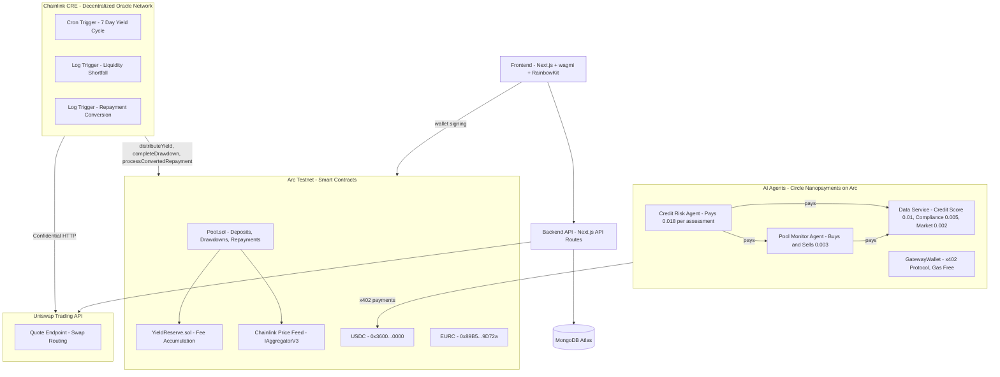
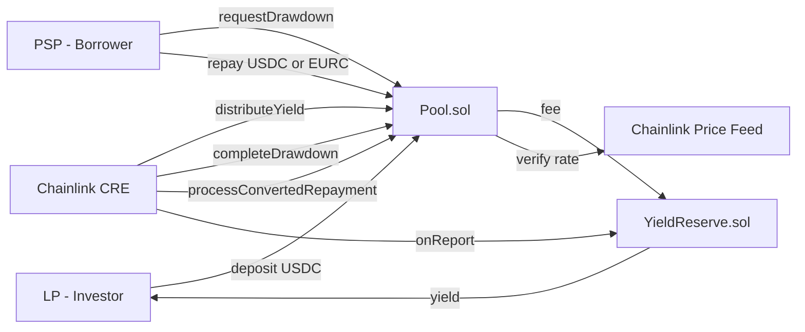
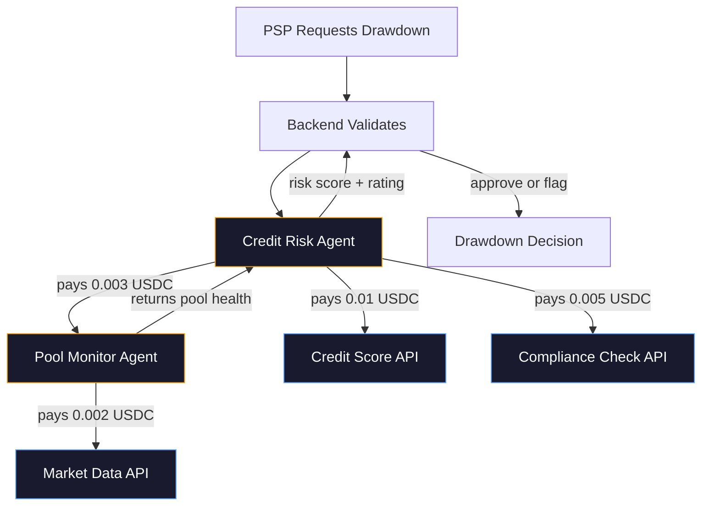
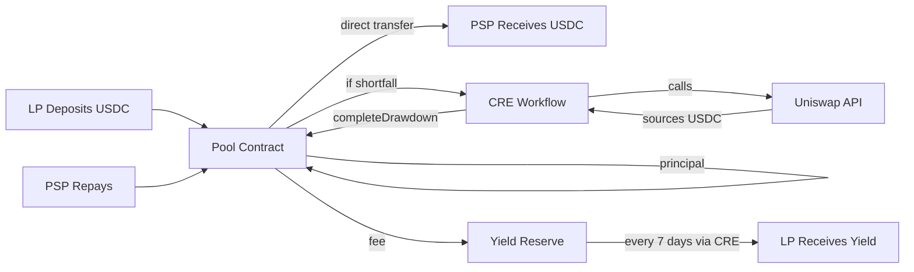

# PayMate Architecture

## System Overview

## Smart Contract Layer (Arc)

## Nanopayment Agent Flow (Arc)

## Fund Flow

## Deployed Contracts

| Contract | Address | Explorer |
|---|---|---|
| Pool | `0xf9F800B7950F2e64A88c914B3e2764B1e8990955` | [ArcScan](https://testnet.arcscan.app/address/0xf9F800B7950F2e64A88c914B3e2764B1e8990955) |
| YieldReserve | `0xe7E0C0c9Ec9772FF4c36033B0a789437023B34e3` | [ArcScan](https://testnet.arcscan.app/address/0xe7E0C0c9Ec9772FF4c36033B0a789437023B34e3) |
| USDC (Arc) | `0x3600000000000000000000000000000000000000` | Native |
| EURC (Arc) | `0x89B50855Aa3bE2F677cD6303Cec089B5F319D72a` | [ArcScan](https://testnet.arcscan.app/address/0x89B50855Aa3bE2F677cD6303Cec089B5F319D72a) |
